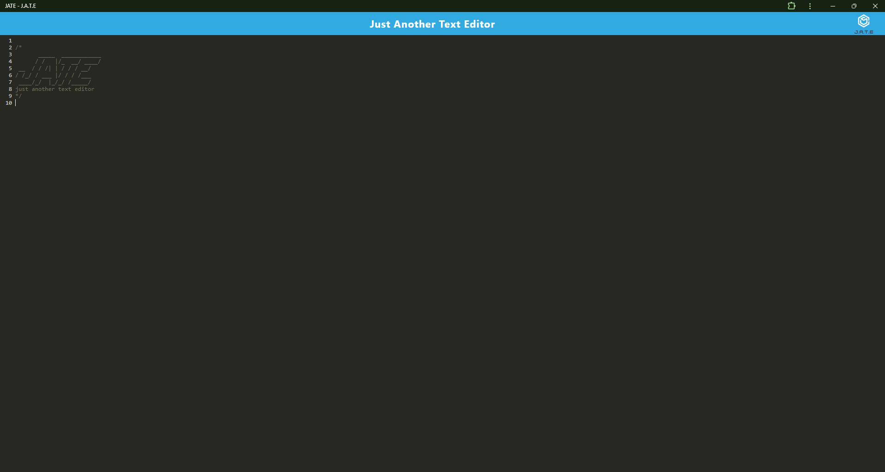
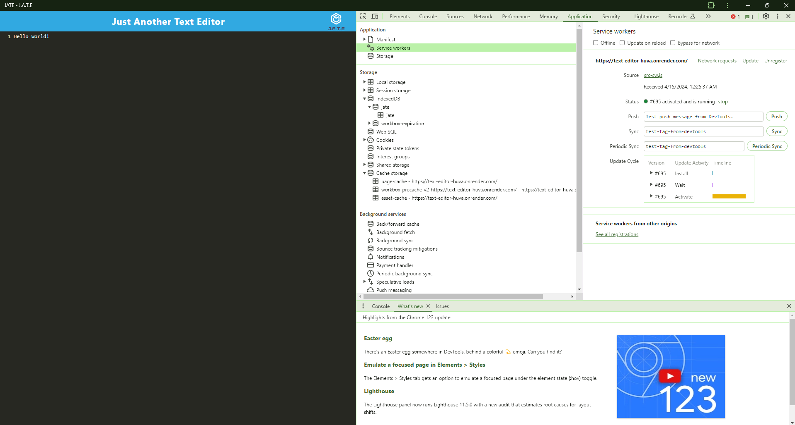
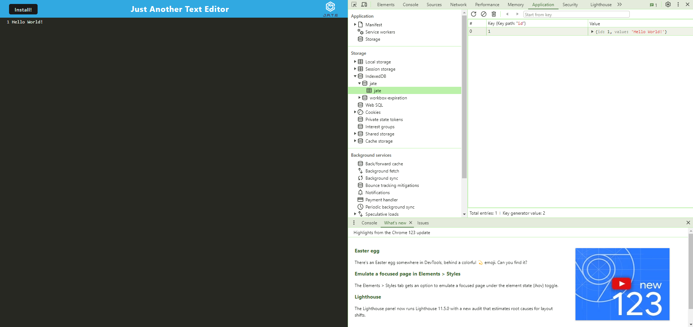

# Text Editor

## Table of Contents

* [Description](#description)
* [Installation](#installation)
* [Usage](#usage)
* [Credits](#credits)
* [Screenshots](#screenshots)
* [Video](#video)
* [Link to Website](#link-to-website)
* [License](#license)

## Description

Text Editor is an application that allows the user to create text or notes with or without an Internet connection.

## Installation

## Usage

## Credits

Tutor Assistance Provided by Alexis San Javier

YouTube Channel Accessed for Function Guidance: https://www.youtube.com/@thoscalle4104 by Thomas Calle

Project Done in Collaboration with coding students Kalyn Sifuentes, Joshua Hale, and Itzel Hernandez.

## Screenshots

Home Screen:

Service Worker Screen:

IndexedDB Screen:

## Video

N/A

## Link to Website

Link to Render Deployed Website: https://text-editor-huva.onrender.com/

## License

This application is licensed under the Apache 2.0 License.

https://opensource.org/licenses/Apache-2.0