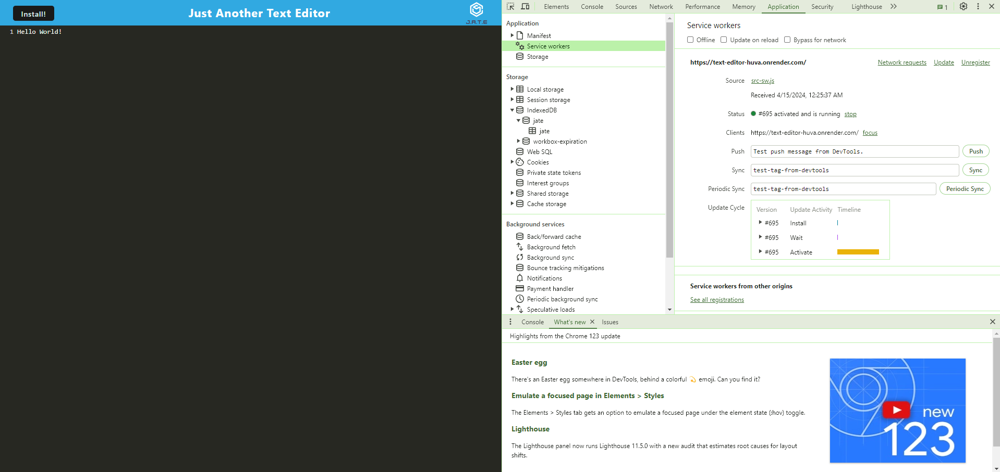

# Text Editor

## Table of Contents

* [Description](#description)
* [Installation](#installation)
* [Usage](#usage)
* [Credits](#credits)
* [Screenshots](#screenshots)
* [Video](#video)
* [Link to Website](#link-to-website)
* [License](#license)

## Description

Text Editor is an application that allows the user to create text, code, or notes with or without an Internet connection. The user can access this application and its functionality from the live website link or on their local computer.

## Installation

Prior to installing Text Editor, the user will need Node.js and a code editor such as VS code installed on their computer. In order to install this application, the user must clone the GitHub Repository on their computer. Once the repository is cloned, it can be accessed using a code editor such as VS Code. The user will need to access this file and in root directory the user will need to enter `npm install` in the CLI to install all dependencies. Next, the user will need to enter the command `npm start` while still in root directory. When the application is accessed using a browser, the user can click the "Install" button in the navbar to also create an icon on their desktop. This will provide the user the capability of using the app and all of its funcationality in a local environment without Internet connectivity.

## Usage

There are two ways to access the application and its functionality. Firstly, the user can enter `npm start` in the CLI while in root directory and then enter http://localhost:3000 in an open browser to access the application. Secondly, the user can click on the "Install" button to create a desktop icon that can be accessed locally without Internet connectivity. The user can then enter text, code, or notes which will be stored for future access.

## Credits

Tutor Assistance Provided by Alexis San Javier

YouTube Channel Accessed for Function Guidance: https://www.youtube.com/@thoscalle4104 by Thomas Calle

Project Done in Collaboration with coding students Kalyn Sifuentes, Joshua Hale, Christina Carroll and Itzel Hernandez.

## Screenshots

Home Screen:

Service Worker Screen:

IndexedDB Screen:

## Video

N/A

## Link to Website

Link to Render Deployed Website: https://text-editor-huva.onrender.com/

## License

This application is licensed under the Apache 2.0 License.

https://opensource.org/licenses/Apache-2.0